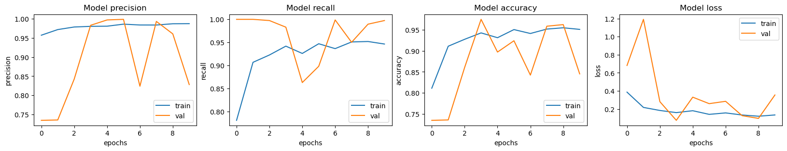
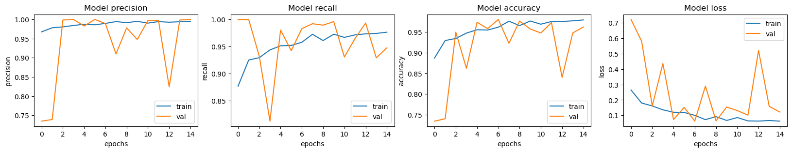
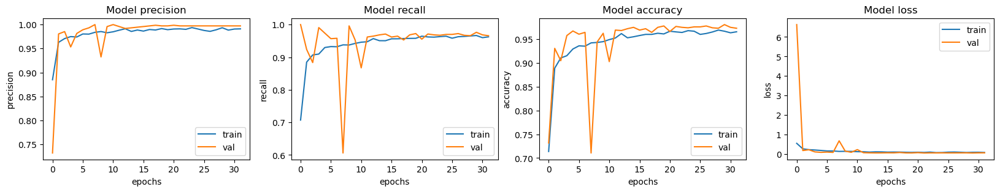
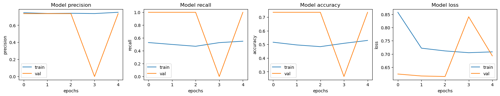
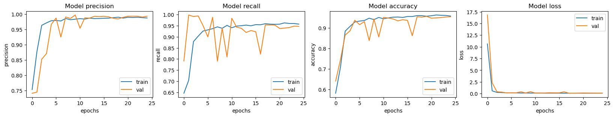

  
***
## 회고록 딥러닝으로 시작하는 CV 
Chest X-ray 사진으로 normal 과 pneumonia(폐렴증상) 구분하기 
가장 기본 노드 세팅 결과 

기본 노드에서 epoch, batch_size, dense레이어 주석처리 결과 

기본 노드에서 epoch(45), date agument(좌우반전), callback 등 결과 

데이터 셋을 다양하게 만들수록(좌우 반전등), 에폭을 늘려서 학습량을 증가시키는 등 

뭔가 많이 할수록 성능은 좋아진다. 

그것이 범용 성능까지 좋아지는지 확인이 필요해보인다 

---------------------------------------------------------------- 
Resnet18 구현을 잘 했는지 모르겠다 
 
일단 코드가 돌아가니까 다행인듯 싶다 
시간이 없어 epoch 수가 작아 시각적으로는 튀는 현상이 두드러지게 보인다 
scan작업에서도 epoch 수가 적을 때 튀는 현상을 보여주었다 
아 그리도 recall 값이 1이 나온다. 그 이유도 찾아야 한다. 
 
Resnet code 구현 따라가기가 너무 힘들었다. 
머리로는 진행방향을 알겠는데 코드적으로 따라 쓰면서 내려가는게 안된다. 
차후 epoch수를 더 늘려보는 작업 등을 통해 recall 등 결과값 개선하는 작업을 해봐야겠다 
-----------------------------------------------------------
전 학습단계 결과로 recall 값이 1 또는 0이 나와서 개선점을 찾다가 
학습 전처리 과정중에 shuffle_buffer_size가 데이터셋에 비해 작은 숫자면 
일부 데이터만 학습될 수 있다는 chat_GPT(3.5?) 정보에 따라 
(train+val)_ds의 합(약 6100)보다 많은 8500으로 진행하니까 
recall 비정상 값이 사라진...? 결과를 얻어냄 

초기 설정 결과 값 

shuffle_buffer_size 변경 

 