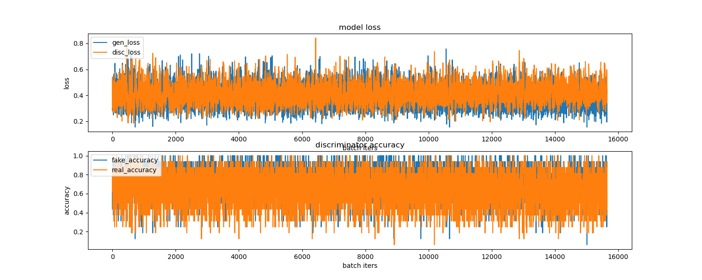
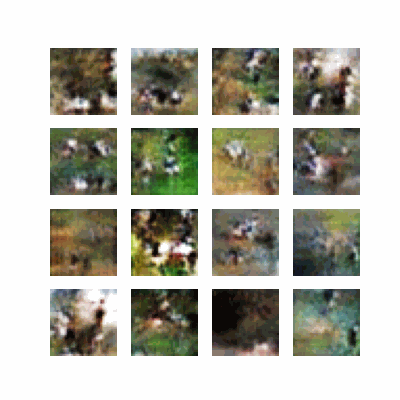
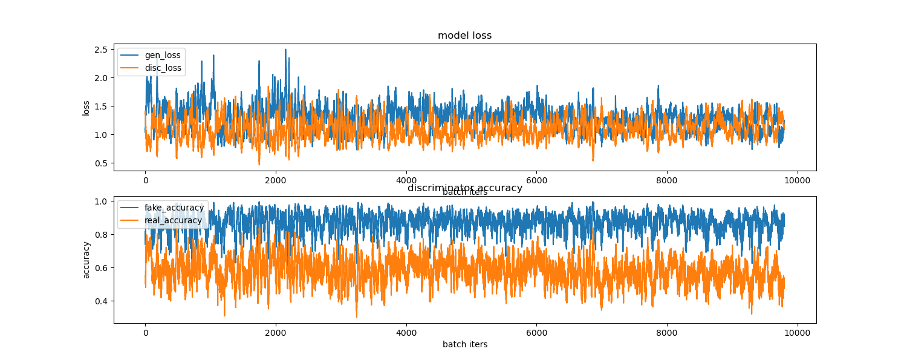
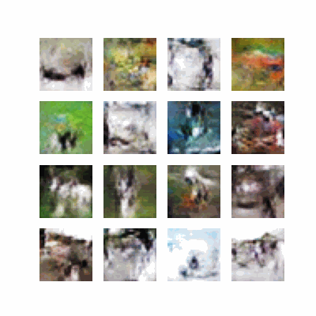

## Segmentation
 
fmnist.ipynb : 7번노드 fashion mnist 
cifar10.ipynb : 7번노드 활용 cifar-10코드 
cifar10v2.ipynb : +레이어층, 손실함수 변경 
 

결과 
## CIFAR-10v2 기준 
학습시간이 오래걸려 사슴라벨만 골라내서 사용 

1. Train History 

2. 생성이미지 품질 시각화 

 

## CIFAR-10 기존학습 기준  

1. Train History 

2. 생성이미지 품질 시각화 

### CIFAR-10v2 변경점
기존 판별자 모델에서 Dropout 수치를 0.3에서 0.5로 상향 조정 
기존 생성자, 판별자 모델에서 레이어층을 하나씩 추가 
손실함수를 기존 cross_entropy에서 least square loss 사용(최현우 그루님, 이혁희 그루님 아이디어 감사합니다) 

## 회고
시간을 들여 epoch를 계속 추가해주면 생성이미지는 뭔가 만들어내려고 하는게 보였다. 
하지만 생성이미지가 기존데이터를 따라잡았다라고 할만큼 품질이 좋진 못했다. 
교육을 들으며 점점 깊게 각인되는것은 시간을 들여 만들어진 모델이 중요하구나 
누군가 만들어놓은 좋은 모델을 잘 쓰는게 좋은것이구나 라는 생각이다 
