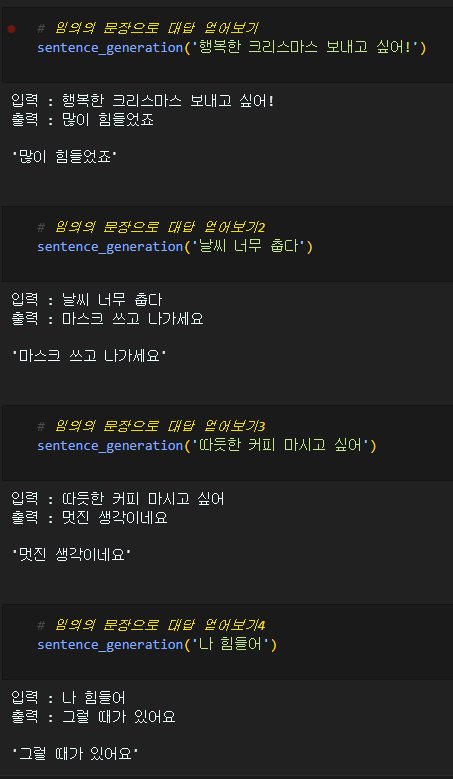
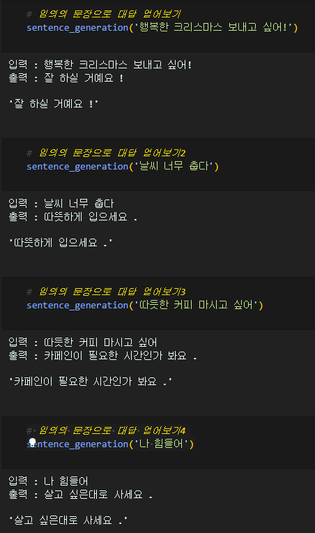

## Transformer (chatbot)
 
chat_bot1~4 : 특수문자 및 구두점 제거 전처리, vocab_size, MAX_LENGTH 등 수치 변경 
chat_bot5~8 : 위키독스 전처리 적용, vocab_size, MAX_LENGTH, epochs 등 수치 변경 
기준은 chat_bot4로 해주시면 됩니다. 나머지는 4와 비교용으로 작성했습니다 
 

결과 
## chat_bot4 

 

## chat_bot8 

## 회고
트랜스포머를 이해하는게 너무 어려웠음 
코드 따라가기가 극한으로 어려워진 노드 내용 
vocab_size와 MAX_LENGTH에 따라 수치가 살짝살짝 변하는데 어떠한 영향을 미치는지 모르겠음 
뭔가 답변이 기분나쁨... 그냥 기분나빠... 원본 데이터에는 따듯하게 답변한거 같은데 챗봇의 답변은 그냥 차가운느낌 
지워진 결과중 하나는 크리스마스에 대한 답변으로 '남에게 피해주고 생각해요' 라는 출력값이 나왔음 
지금은 형태소 분석을 통한 전처리가 아니기 때문에 다음에 실험을 한다면 형태소 분석 전처리를 해볼 생각 
추가적인 데이터가 구해진다면 더하는것도 좋을거라 봄 
