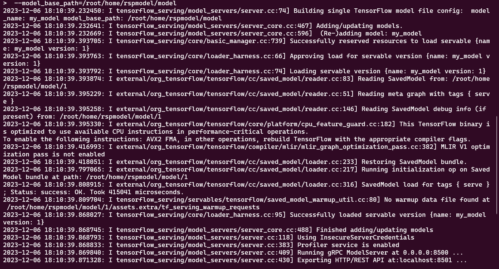

## Transformer (chatbot)
 
keras_tuner : 노드 내용 따라간 파일 
rsp_tuner : 가위바위보 했던 프로젝트 튜너 적용 
 

### 우분투로 배포하기

## 회고
우분투 환경에 docker에 wls 까지 안해본 환경 설정하려니까 아주 죽을맛 
오류 뜨면 해결도 힘들어서 그냥 삭제 후 다시 천천히 따라가야했음... 
케라스 튜닝에 모델부분 수정해서 해보고 싶었는데 시간 없어서 그냥 진행하였음 
그냥 적용하려니 쉽게 적용 가능한 가위바위보 프로젝트로 진행함 
결과부분 보면 loss랑 accuracy의 수치가 좋아진것을 확인할 수 있었다 
역시 알아서 튜닝해주는게 최고 

