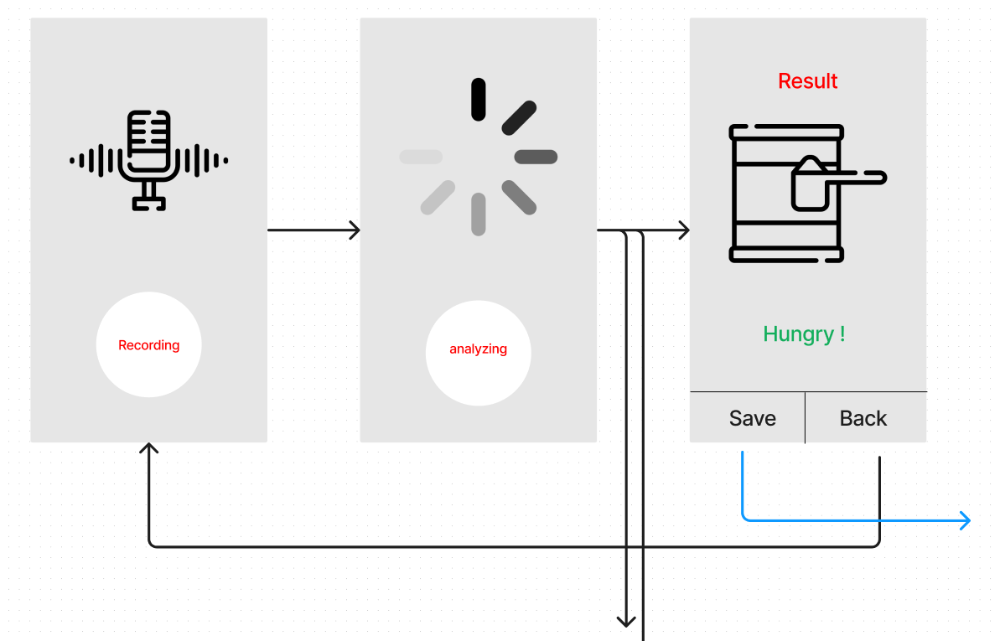

## AIFFEL Flutter Main Quest

1. Roadmap

2. Describes

신생아의 울음소리는 크게 5가지로 구분할 수 있다고 한다. 
배고픔(NEH), 졸림(OWH), 불편(HEH), 속불편(EAIR), 트름(EH)으로 구분할 수 있다. 
각 울음소리 별로 특징을 가지고 있다. 
이 특징을 구분하여 신생아의 울음이 어떤 의미를 가지고 있는지 
해석하여 알려주는 서비스를 제공 

***
첫 메인 화면은 아이의 울음소리를 녹음하는 화면, 녹음의 시작과 끝을 첫 화면에서 담당 
녹음이 끝나고 첫화면에서 분석버튼을 누르면 분석중인 화면을 보여줌 
세번째 화면은 분석 결과를 보여주고 이 결과를 저장할 것인지 첫 화면으로 돌아갈 것인지를 선택 
이 결과를 저장하여 이용한다면 추후 아이의 울음 패턴을 확인 할 수 있는 서비스까지 개발 
***
이번주 내내 몸이 좋지 않아 퀘스트 진행을 하지 못했습니다.... 
***
reference 
https://www.youtube.com/watch?v=vm3q1qzpB-4
(내용만 집중해서 보기)

https://www.dbpia.co.kr/journal/articleDetail?nodeId=NODE08758236