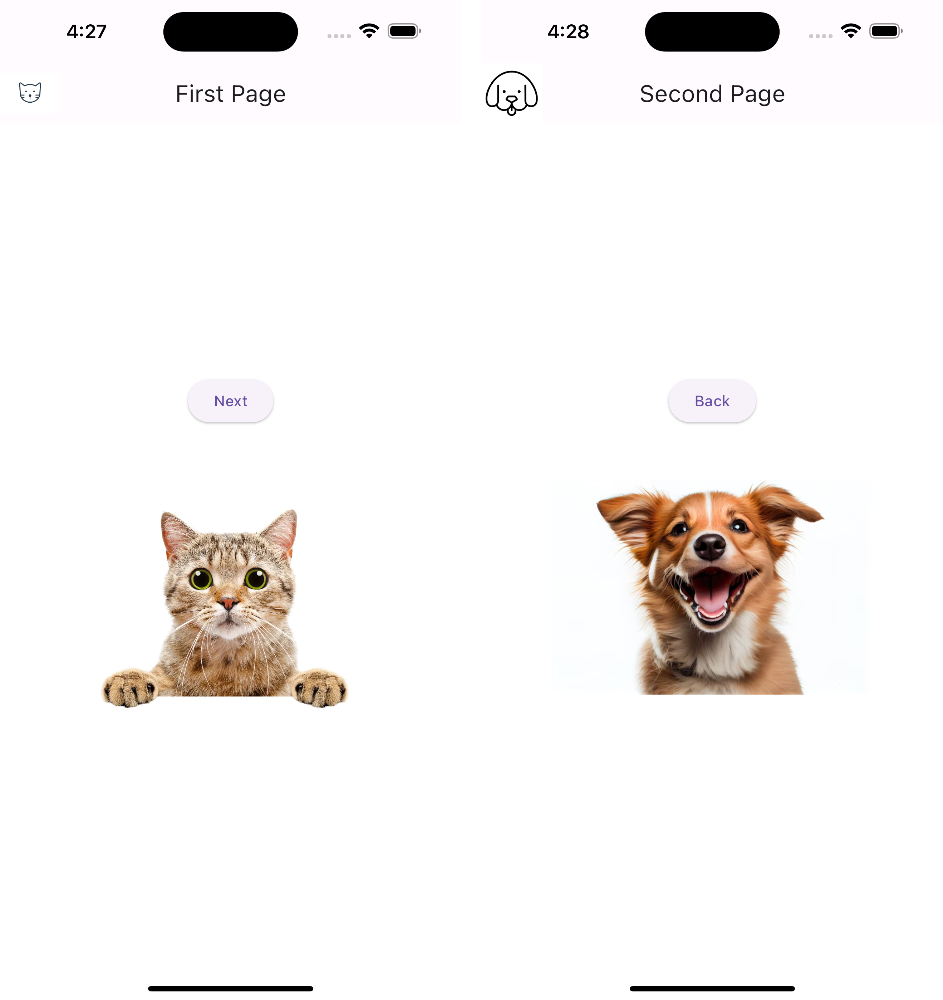
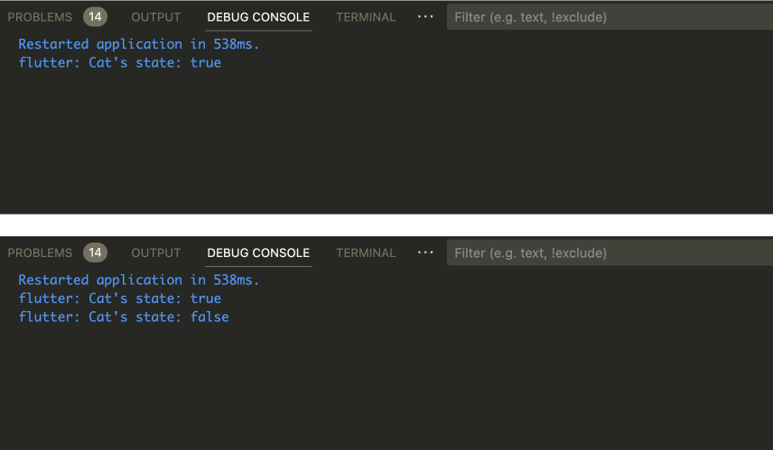

## AIFFEL Campus Online Code Peer Review Templete
- 코더 : 김연, 강임구

1. Pages

2. debug console (Next 누른 반응, Back 누른 반응)

***
김연그루분이 주도적으로 코딩을 이끌어주셨다(김연그루님 지분100%) 
책에서 공부한 개념적인 내용을 실행해보지 못하고 퀘스트를 접하였는데 
김연님의 코딩을 따라가보니 책의 내용이 복습이 되었다. 
이전까지는 어버버 하면서 '되..되는구나'의 느낌이였지만 
오늘 김연그루분께서 설명해주시면서 코딩하시는 걸 보니 
뭔가 스케치에 색칠이 되어가는 느낌이였다. 
오늘 이혁희그루분께서 플러터 기본개념을 또 자세히 설명해주셔서 
머릿 속 하얀 백지에 스케치가 그려졌었는데 그게 조금 더 채워진 느낌 
이번 주말을 통해 다시 복습해보면 혼자서 코딩을 따라할 수겠지...? 