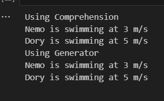

## AIFFEL Campus Online Code Peer Review Templete
- 코더 : 강임구
- 리뷰어 : 지동현


## PRT(Peer Review Template)
- [X]  **1. 주어진 문제를 해결하는 완성된 코드가 제출되었나요?**
    - 
    
- [X]  **2. 전체 코드에서 가장 핵심적이거나 가장 복잡하고 이해하기 어려운 부분에 작성된 
주석 또는 doc string을 보고 해당 코드가 잘 이해되었나요?**
```python
#컴프리헨션 사용해서 순서대로 출력 f스트링으로 출력값 위치 설정
def show_fish_movement_comprehension(fish_list):
  output = [f"{fish['이름']} is swimming at {fish['speed']} m/s" for fish in fish_list]
  print('\n'.join(output))
#조인 사용해서 \n 줄바꿈으로 구분하여 출력

#순서대로 출력하도록 제너레이터를 만듬, 출력 위치랑 값은 f로 조정
def show_fish_movement_Generator(fish_list):
  for fish in fish_list:
    yield f"{fish['이름']} is swimming at {fish['speed']} m/s" 
```
- 각 함수를 정의할 때 주석을 달아 이해하기 쉬웠습니다.
        
- [ ]  **3. 에러가 난 부분을 디버깅하여 문제를 “해결한 기록을 남겼거나” 
”새로운 시도 또는 추가 실험을 수행”해봤나요?**

        
- [X]  **4. 회고를 잘 작성했나요?**
```python 
# x for x in 이터러블 객체 에서 좀 더 생각해야 하는 코드와
# 제너레이터 반복 학습을 위한 퀘스트
# 수학에서 심화학습 하듯이 코드도 심화학습이 필요한 것 같은데
# 그 부분을 퀘스트가 해결해 주는 것 같다
# 따라가기 엄청 어렵다...
# 코드 작성에 도움을 주신 김연 그루분께 감사드립니다.
```
        
- [X]  **5. 코드가 간결하고 효율적인가요?**
    - 네


## 참고 링크 및 코드 개선
```
# 코드 리뷰 시 참고한 링크가 있다면 링크와 간략한 설명을 첨부합니다.
# 코드 리뷰를 통해 개선한 코드가 있다면 코드와 간략한 설명을 첨부합니다.
```
